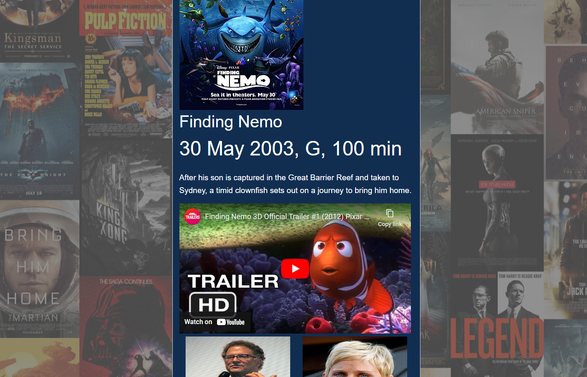

# Movie-buff

## Description
 
Movie Buff is a movie search app that allows users to search for movies by title and provides detailed information such as movie posters, plot summaries, cast details, and trailers for users to watch. The app aims to enhance the movie-watching experience by offering a convenient platform to explore and discover movies.

The app has a search functionality which enable users to enter a movie title in the search bar to find relevant movies.
Upon selecting a movie from the search results, the app will display the movie's poster to provide a visual representation of the movie, plot summary offering an overview of the movie's storyline, cast details including the names of actors and actresses involved in the movie, and trailer to enable user to watch a preview or promotional video of the movie.

The app integrates with movie-related APIs (such as IMDb, Rotten Tomatoes & Youtube) to retrieve movie data, including posters, plot summaries, cast details, and trailers.
Also, the app is responsive and compatible with various devices such as smartphones, tablets, and desktops, ensuring a consistent experience across different screen sizes

## How to use
1. Navigate to the static github page listed in the README.
2. Enter in a movie name you would like to search for.
3. Movie name, summary, tralier and a ferw main actors should popup in a modal.

note: When searching for a movie exact names must be used e.g. "finding nemo" will generate a movie while "nemo" will display an error modal.

## Technologies used

- VS Code
- Fetch API
- Foundation 
- Google Fonts
- FontAwesome
- Wikipedia API
- OMDB API
- JQuery 
- @Media

## Credits

- Hailin https://github.com/Hailin-Ruan 
- Jarrod https://github.com/jarrodbb 
- Kalid https://github.com/KalidNadere 
- Tristan https://github.com/Bemonn 

## Deployed app website

https://bemonn.github.io/Movie-buff/ 

## Screenshot of website deployed

 

## Licence

Please refer to the licence in the repo.
